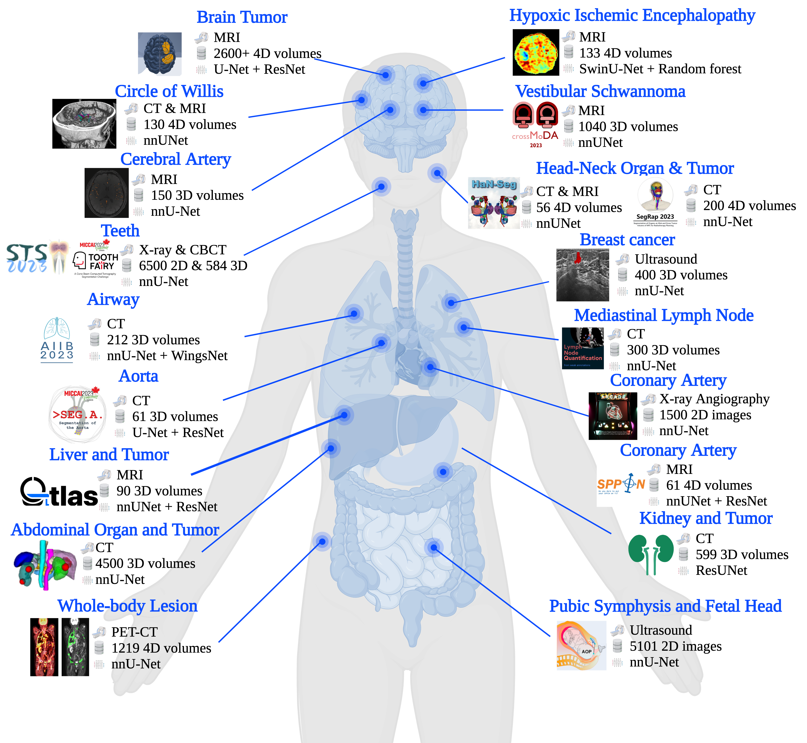
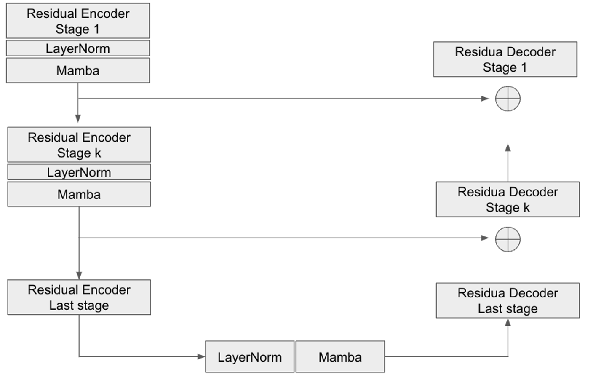

# U-Mamba: Enhancing Long-range Dependency in Medical Image Segmentation

 # make it smaller

[code](https:tbd)

[paper](https:tbd)

[data](https:tbd)

## Background

U-Net and its variants still dominate current medical image segmentation. 

## Architecture

this is a place holder

## Results

